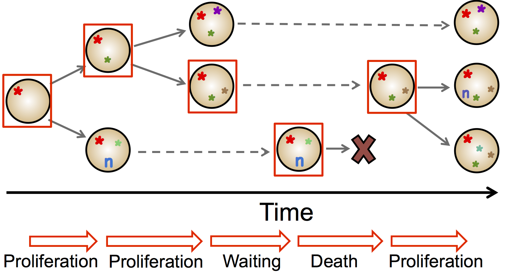

# CloneGrowthSimulation

Mutations accumulated in a developing tumour can give rise to genetic alterations that lead to a novel peptide sequence presented on the cell surface and picked up by the immune system identifying the tumour as 'non-self'. Such mutations have the potential to elicit an immune response and consequently result in an increased death probability of their host cell. The above scripts implement a stochastic branching process-based simulation of tumour growth, taking into account the chance acqusition of neoantigen/neoepitope mutations. For results and further discussion, see our preprint, [Evolutionary dynamics of neoantigens in growing tumours](https://www.biorxiv.org/content/10.1101/536433v1).

## Simulation details

First, a single progenitor cell is defined that already carries a set of mutations providing it with sufficient growth/survival advantage to outgrow a normal cell population. Each of the cell’s mutations have a unique identifier, and that cell has an intrinsic immunogenicity value determined by its mutations. Starting from this single-cell tumour, in each simulation step a cell in the population is selected, and that cell undergoes one of three possible life events:

– Proliferation: The cell divides and gives birth to two daughter cells. These cells carry all mutations and information contained in the mother cell, but also acquire new mutations. For each newly generated mutation, it is randomly decided whether the mutation is antigenic.

– Death: The cell dies and is removed from the population. 

– Waiting: No proliferation or death event happens; the cell is not altered in any way. 

The probability of each event is defined by the cell’s proliferation and death rate (_b_ and _d_) as _b/(b + d_max)_, _d/(b + d_max)_ and _1 – (b+d)/(b + d_max)_, respectively.
In proliferation events, each daughter cell gains _N_m_ new, independent mutations, where Nm is sampled from a Poisson distribution with parameter _μ_, the cell’s mutation rate. Antigenicity is randomly assigned to newly generated mutations according to the antigen production rate, _p_; the probability that a newly generated mutation has immunogenic properties.
The above step of randomly selecting a cell and one of the three possible events is repeated until the tumour reaches a predefined population size (representing the tumour reaching a clinically detectable size, set by the value _popSize_) or sufficiently long time elapsed without tumour establishment (corresponding to no cancer formation in the patient’s lifetime, set to 300 time units).

The effect of the immune system on neoantigen-carrier cells is modelled as an increase in cell death probability, representing additional T-cell mediated death that depends on the selection strength, _s_, and the number of neoantigen mutations in the cell, _n_. Non-immunogenic cells are assigned a basal death rate of _d0_, whilst immunogenic cells have an increased death rate, _d_, computed as _d = (1 + s*n)*(d0 - b0) + b0_.

### Extended simulations with immune escape

We also consider the acquisition of immune escape through tumour growth. Immune escape is modelled as a heritable property of a cell, the Boolean variable _escaped_.
The ability of immune evasion is gained either randomly during mutation acquisiton with probability _p_esc_; or through manually setting a particular cell's _escaped_ value to achieve clonal or subclonal escape.
The simulated escape is an approximation of active evasion (such as PD-L1 overexpression), which shields the cell from negative selection (decreasing its death probability to _d0_) but leaves neoantigen-carrier cells highly immunogenic. This makes escaped cells vulnerable to the immune system after immunotherapy, simulated by the cancellation of the original shielding effect.

In the simulation "EscapeDouble" we consider a second type of escape mechanism: passive evasion, which lowers the cell’s immunogenicity in the presence of neoantigens (representing escape mechanisms arising from loss/mutation of antigen-presentation machinery).

