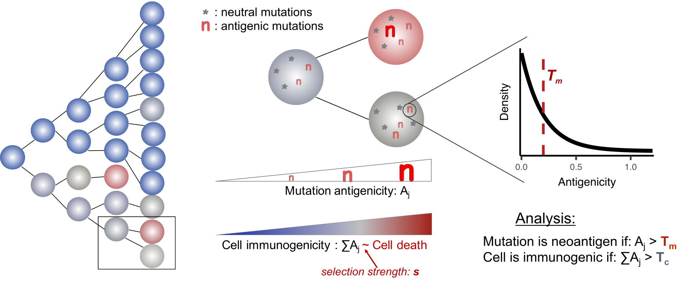
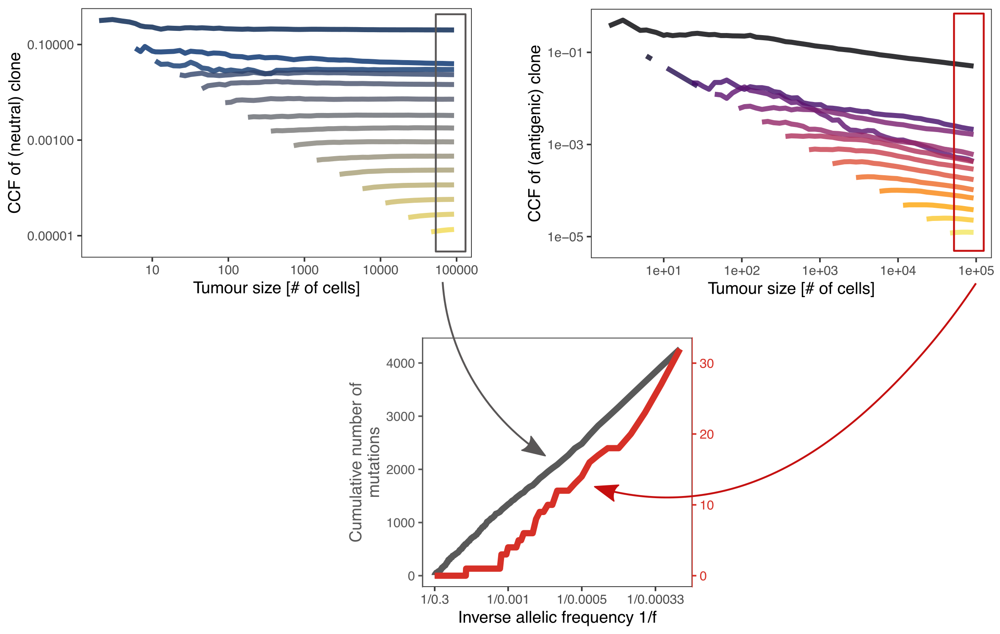

# CloneGrowthSimulation

Mutations accumulated in a developing tumour can give rise to genetic alterations that lead to a novel peptide sequence presented on the cell surface and picked up by the immune system identifying the tumour as 'non-self'. Such mutations have the potential to elicit an immune response and consequently result in an increased death probability of their host cell. The scripts in this repository implement a stochastic branching process-based simulation of tumour growth, taking into account the chance acqusition of neoantigen/neoepitope mutations and consequent immune predation. For results and further discussion, see our preprint, [Evolutionary dynamics of neoantigens in growing tumours](https://www.biorxiv.org/content/10.1101/536433v1).

## Model details

Our mathematical model of neoantigen evolution during tumour growth is based on a stochastic branching process. Tumour evolution is initiated by a single transformed cell, and cells produce two surviving offspring at birth rate _b_ (set to 1) per unit time. Each time a cell divides, it acquires new unique mutations at overall rate based on Poisson distribution with parameter _mu_, which are randomly labelled as neoantigens with rate _p_. Each antigenic mutation is assigned an antigenicity value (denoted _Aj_ for the jth antigen in a given cell) sampled from an Exponential distribution. Neoantigens cause the death rate of the lineage to increase from a basal rate of _d0_ to a higher value determined by the strength of negative selection against each new neoantigen, _s_, and the cumulated antigenicity of neoantigens harboured in the lineage, _∑Aj_. Consequently, the death rate of a particular cell in (denoted with index _i_) is computed as:
_di=(1+s*∑{j}Aj^i )(d0-1)+ 1._
where _s=0_ stands for no selection pressure (neoantigens carry no disadvantage, neutral evolution), and _s<0_ for selection against neoantigens.

### Simulation steps

First, a single progenitor cell is defined that is assigned _initial_mut_ number of mutations, each of which mutations have a unique identifier. Starting from this single-cell tumour, in each simulation step a cell in the population is selected, and that cell undergoes one of three possible life events:

– Proliferation: The cell divides and gives birth to two daughter cells. These cells carry all mutations and information contained in the mother cell, but also acquire new mutations. For each newly generated mutation, it is randomly decided whether the mutation is antigenic.

– Death: The cell dies and is removed from the population. 

– Waiting: No proliferation or death event happens; the cell is not altered in any way. 

The probability of each event is defined by the cell’s proliferation and death rate (_b_ and _d_) as _b/(b + d_max)_, _d/(b + d_max)_ and _1 – (b+d)/(b + d_max)_, respectively. The cell-specific death rate, _d_ is set according to the formula above.
In proliferation events, each daughter cell gains _N_m_ new, independent mutations, where Nm is sampled from a Poisson distribution with parameter _μ_, the cell’s mutation rate. Antigenicity is randomly assigned to newly generated mutations according to (i) the antigen production rate, _pa_; the probability that a newly generated mutation has immunogenic properties, (ii) the prior antigenicity distribution (Exponential with scale 0.2 / rate 5) from which an antigenicity value is randomly assigned to any new neoantigen.

The above step of randomly selecting a cell and one of the three possible events is repeated until the tumour reaches a predefined population size (representing the tumour reaching a clinically detectable size, set by the value _popSize_) or sufficiently long time elapsed without tumour establishment (corresponding to no cancer formation in the patient’s lifetime, set to 300 time units).

### Extended model & simulations with immune escape

We also consider the acquisition of immune escape through tumour growth. Immune escape is modelled as a heritable property of a cell, the Boolean variable _escaped_.
The ability of immune evasion is gained either randomly during mutation acquisiton with probability _p_esc_; or through manually setting a particular cell's _escaped_ value to achieve clonal or subclonal escape.
The simulated escape is an approximation of active evasion (such as PD-L1 overexpression), which shields the cell from negative selection (decreasing its death probability to _d0_) but leaves neoantigen-carrier cells highly immunogenic. This makes escaped cells vulnerable to the immune system after immunotherapy, simulated by the cancellation of the original shielding effect.

## Results at a glance

Overall, we find that, as expected, negative selection of antigenic mutations leads to an increased depletion of neoantigen-carrier cells compared to their non-immunogenic counterparts. Consequently, the proportion of cells carrying a particular antigenic mutation (in other words, the clone characterised by that mutation) declines over time, since the clone has a proliferation disadvantage compared to other, non-antigenic clones. The top panel of the figure above shows the average frequency (cancer cell fraction, CCF) of all mutations that first appeared at a population size of 2, 4, 8, etc (from dark to light lines). Neutral mutations (left) stay at the frequency they were introduced, whilst negatively selected antigenic mutations decline as the population grows.

As all antigenic mutations are subject to depletion, by the final time-point (highlighted with rectangles) a number of negative selection specific characteristics emerge:

- The tumour population overall is dominantly antigen-cold: most cells carrying very few and mostly negligible antigens. By random drift, some antigen hot populations can arise as well, where a strongly immunogenic clone became the founder of the population. These tumours can only reach detectable size at low to moderate selection strengths.

- There is a relative lack of neoantigens in the large subclonal regime (CCF above 1e-3), whilst neutral mutations remain evenly dispersed according to their time of appearence. This can be directly measured from the variant allele frequency (VAF) distribution of mutations, as shown in the bottom panel of the figure. The overall VAF distribution is governed by neutral mutations and hence follows the characteristic neutral 1/f cumulative distribution (see [Williams et al., 2016](https://www.nature.com/articles/ng.3489)). The neoantigen-only VAF distribution, on the other hand, shows a depletion in the subclonal regime, due to mutations declining to lower frequencies.

- The number of antigenic mutations that can be detected in the population is very low (only 30 in the above figure) and most of them would require ultra-high depth sequencing to pick up (mutations at VAF 0.001 would need >1000x depth). However, one can detect this depletion and therefore negative selection, by comparing the proportional neoantigen burden (percentage of detected mutations that are antigenic) to an expected neutral value or another population.

In addition, we observe a strong selection for immune escape under moderate and high selection strength, which is especially apparent in hyper-mutated tumours that carry a higher mutation burden and are typically immune hot due to rapid accummulation of antigenic mutations. These tumours can only reach detectable size if by chance they acquire an immune escape mutation that subsequently returns them to neutral dynamics (upper left panel).

Therefore we expect most tumours to appear effectively neutrally evolved in their VAF distribution, due to (i) insufficient number of neoantigen mutations to detect selection; (ii) very weak selection; (iii) acquisition of immune escape.

